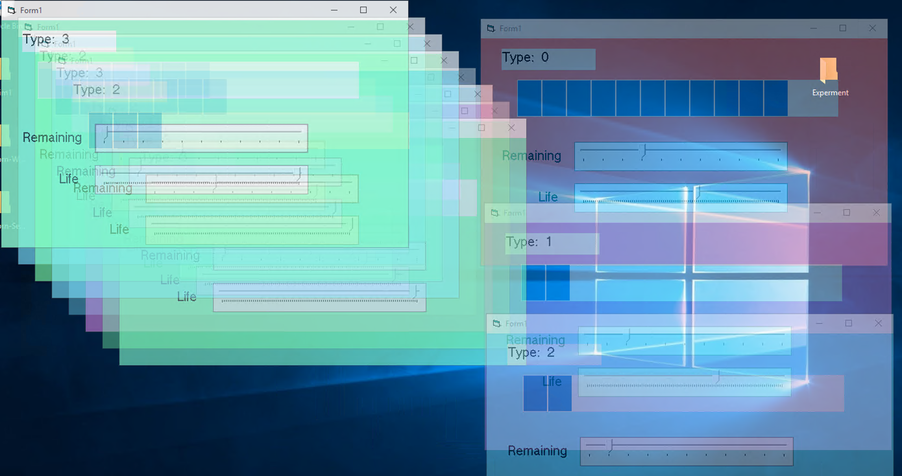

# Visual Basic code for Biology org growing, olding Research.

Currently a simple multi cells living-being might be simulated rough.

Suggest to run in Windows VM with 4 Cores and 8GB RAM.

# Usage

Build in VB98 (VB6), then create a folder, put the exe into it then name it "A1.exe". Double click "A1.exe", then it will grow an org.

Red: (A-%d.exe) The Progenitor cells

Purple: (B-%d.exe) The second generation stem cells

Cyan: (C-%d.exe) The third generation stem cells

Green: (D-%d.exe) The somatic cells

Each type of cells have their Split and Life counter, and you can adjust it your self.

# Research value

Edit the code of Progenitor cells and try for eternal life.

# Credits

UEFI, Cookie.

